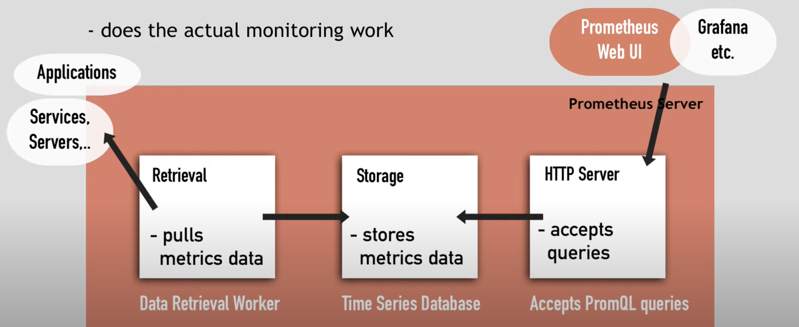
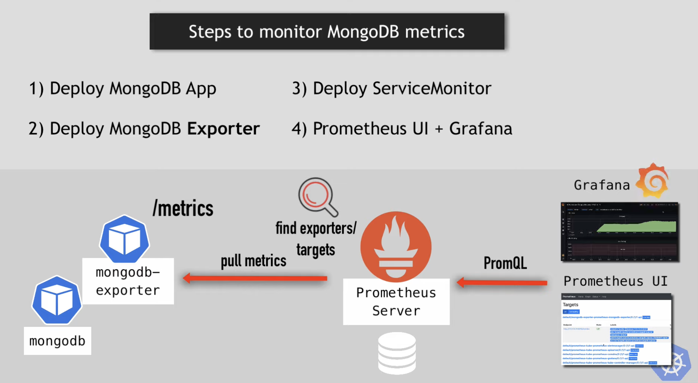
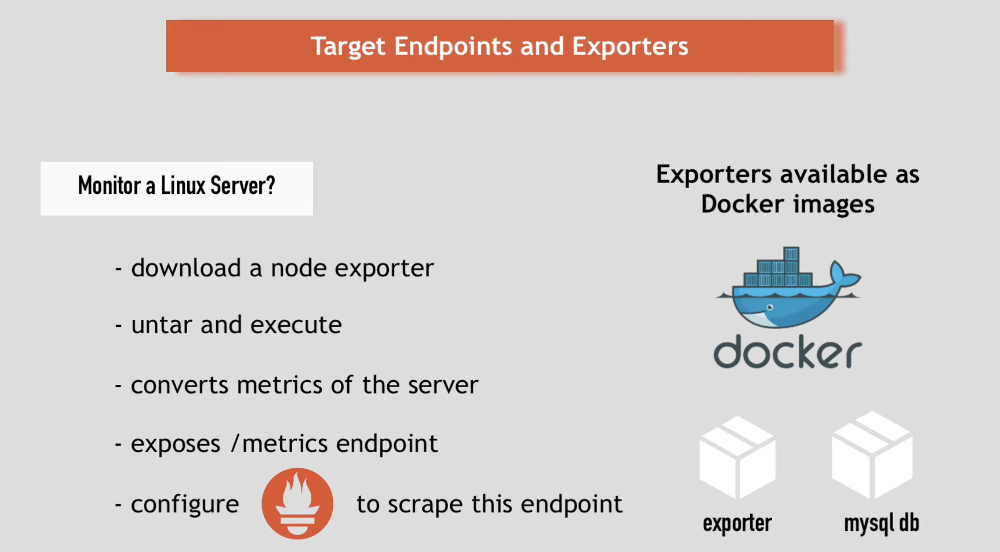
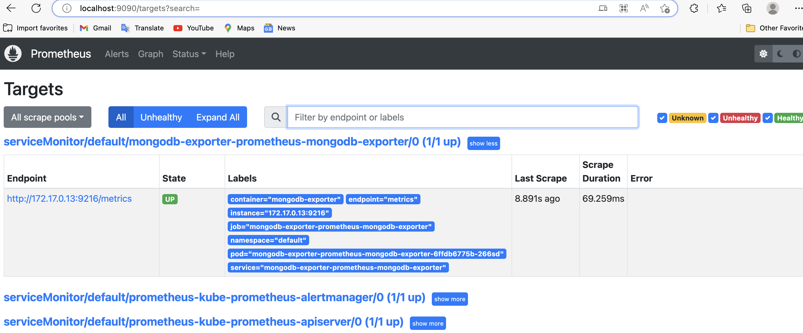

# Prometheus





## Installation

- Helm: initiale setup

- Operator: manage setup

[helm-charts](https://github.com/prometheus-community/helm-charts/tree/main/charts/kube-prometheus-stack)

```bash
helm repo add prometheus-community https://prometheus-community.github.io/helm-charts
helm repo update
```

```bash
helm install [RELEASE_NAME] prometheus-community/kube-prometheus-stack
```

Mainly this will setup all thing need include **prometheus**, **operator** and **grafana**.

Check:

for **prometheus**:

```bash
kubectl port-forward service/prometheus-kube-prometheus-prometheus 9090
```

for **grafana**:

```bash
kubectl port-forward deployment/prometheus-grafana 3000
```

- The default user name and passwd are `admin` and `prom-operator`


## Deploy the application

In this demo mongodb is used. (Skipped the deploy part can either use mainfast or helm)



### How prometheus descover a new target want to monitor? 

 **servicemonitor(one of k8s conponents)**



**Three things needed:**

- Deploy mongodb

- Deploy mongodb exporter
- deploy servicemonitor

**What are main roles of an exporter:**

- collect data
- convert to metrics
- expose them

[Exporters and integrations | Prometheus](https://prometheus.io/docs/instrumenting/exporters/)

[All Prometheus community Helm charts ](https://github.com/prometheus-community/helm-charts)


## Deploy mongodb exporter

```bash
helm repo add prometheus-community https://prometheus-community.github.io/helm-charts
helm repo update
```

**We need to change some values:**

```bash
helm show values [chart name] > values.yaml
```

- Change the `uri` to the mongodb service url for example: `uri: "mongodb://mongodb-service:27017"`
- Add: ` label release: prometheus` in `additionalLabels` 

- Add`  --collect-all` and `--compatible-mode` in `extraArgs`
- In `serviceMonitor` set `enabled: true`

**Deploy with the changed value file.**

```bash
helm install [RELEASE_NAME] prometheus-community/prometheus-mongodb-exporter -f values.yaml
```

**If want to upgrade use new values:**

```bash
helm upgrade -f values.yaml [RELEASE_NAME] prometheus-community/prometheus-mongodb-exporter
```

**Use `helm ls` to check it deployed correctly.**

```bash
kubectl port-forward service/mongodb-exporter-prometheus-mongodb-exporter 9216
```

Then go the `/metrics` endpoint to check if it can get metrics and In **prometheus** the new target should be **UP**.



**Go the the Grafana to see the data for the pod.**


## Troubleshooting

There are different possible issues if no data is shown.

- Check 3 parts setup correctly: **service**, **servicemonitor** and **Exporter application**

- Check if prometheus get the metrics: Run a simple Prometheus query, such as `mongodb_connections` or `mongodb_mongod_mongod`. 
- Check if Prometheus intergrate with Gafana correctly.
- Check if give the correct permission for a **Exporter** to connect to the application.

